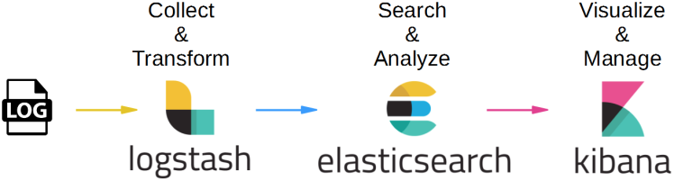

```{r setup, include=FALSE}
knitr::opts_chunk$set(echo = TRUE)
```

# Framework Hadoop

Baseado no framework Hadoop, existem outras opções para armazenar e processar os dados em um contexto de Big Data. Aqui será abordado o [ELK Stack](https://www.elastic.co/webinars/introduction-elk-stack) da [Elastic](https://www.elastic.co/).

# O que é stack ELK

A ferramenta [ELK Stack](https://www.elastic.co/webinars/introduction-elk-stack) (Elasticsearch, Logstash e Kibana) da [Elastic](https://www.elastic.co/) tem tido um uso bastante interessante pois com ela possível filtrar os logs de maneira muito eficiente, eliminando aquilo que não interessa e usando sua engine para decodificar os dados (XML, Multilines, netflow, json e outros) acessá-los em um único lugar e importar.

Seu funcionamento é basicamente o seguinte: O Logstash recebe os logs de distintas fontes, realiza as transformações, normaliza e agrupa os mesmos, indexa no Elasticsearch, por fim, os dados podem ser visualizados no Kibana. Veja na ilustração:

](elk.png)

Alguns dos benefícios do uso dessa ferramenta envolvem: disponibilizar dados em tempo real, podem ser distribuídos e configurados para apresentar alta disponibilidade, disponibiliza recursos de API dentre outros.

Suas ferramentas possuem as seguintes funcionalidades:

  * **[Elastic Search](https://www.elastic.co/products/elasticsearch)**: Um mecanismo de armazenamento e análise, elabora a indexação e possibilita a consulta dos dados, provendo real-time analytics. Possui outras características como escalabilidade, alta-disponibilidade, full text search dentre outros
  * **[Logstach](https://www.elastic.co/products/logstash)**: Atua como um agente de coleta e transformação, faz a captura das informações em arquivos (csv, logs, etc), processa e gera o output para o Elasticsearch
  * **[Kibana](https://www.elastic.co/products/kibana)**: É um dashboard Web para ajudar a visualizar os dados coletados. Tem como características a pesquisa e visualização através gráficos, trendlines, mapas, etc. Além disso permite a exportação de tabelas em csv para análises



Para conferir um demo, basta acessar este link: [http://demo.elastic.co](http://demo.elastic.co/)

# Como utilizar

A seguir, será apresentado um exemplo de uso para buscar por dados no twitter.

**ATENCAO**: tem que ter celular registrado no twitter

## Downloads

O primeiro passo é baixar os três componentes da stack ELK na página oficial do site [https://www.elastic.co/downloads](https://www.elastic.co/downloads)

### Configurar Elasticsearch e Kibana

Após isso, os arquivos devem ser executados da seguinte maneira através do propt de comando (ou entrando na respectiva pasta e abrindo os arquivos executáveis .bat) para realizar sua configuração:

Configurando o Elasticsearch:

  1. descompacte na pasta
  2. entre em /bin
  3. digite: elasticsearch
	entre em: http://localhost:9200
		
Configurando o Kibana:

  1. descompacte na pasta
  2. entre em /bin
  3. digite: kibana
	entre em: http://localhost:5601
	
### Configurar o Logstash
	
Para utilizar o Logstash, primeiramente alguns passos de configuração devem ser seguidos, veremos a seguir.

(Neste exemplo não será utilizado, mas caso deseje baixar os plugins, acesse [https://www.elastic.co/guide/en/logstash/current/codec-plugins.html](https://www.elastic.co/guide/en/logstash/current/codec-plugins.html) )

Obtendo acesso aos dados do Twitter:

1. logar em https://dev.twitter.com/apps
2. registre 'create an application' (Pode escolher qualquer nome para o aplicativo)
    * name     : testeELASTIC
    * descricao: http://testeELASTIC.com
    * URL      : http://testeELASTIC.com
3. abra 'consumer key > manage keys and access tokens'


4. Copie os codigos 'consumer_key', consumer_secret' para o arquivo ['EXEMPLO.conf'](https://www.dropbox.com/s/xqfx6nddpa5owgl/SEMEST.conf?dl=0)
5. Clique em 'Token Actions > Create my access token'
6. Copie os codigos 'oauth_token', oauth_token_secret' para o arquivo 'EXEMPLO.config'
7. Defina as palavras a serem procuradas (cada uma delas 'entre aspas' e com separação por vírgulas)
8. Defina se prefere manter somente poucas informações (mantendo: 'full_tweet => false') ou substituir por recebimento de mais dados (full_tweet => true}})
9. Defina nomes do 'index' e 'document_type' para armazenar os dados (escolha o nome que desejar) 
10. Salve o arquivo 'EXEMPLO.conf' na pasta onde esta o '/logstash-5.6.3/bin'
11. Entre o diretorio '/logstash-5.6.3/bin' e inicie a captura dos dados do TWITTER da seguinte maneira:
    * digite no prompt de comandos: logstash -f EXEMPLO.conf
12. Entre no 'kibana' e acrescente o index 'twitter*'
13. Entre em 'discoverer', depois em 'visualize'

**$Obs_1$**.: Caso pretenda filtrar os 'tweets', inclua conteúdo no filtro ('filter'); sugiro ver no google: 'logstash grok'

**$Obs_2$**.: Interessante procurar mais informações sobre como se faz "mapping" e georeferenciamento

**$Obs_3$**.: Existem pacotes que permitem interagir esse procedimento com o R, dois exemplos são:
    * library(elastic)
    * library(elasticsearch)
    
 Pacote que permite a conexão com *Elasticsearch*, um  banco de dados *NoSQL*.

Mais informações podem ser conferidas no [manual do pacote elastic](https://cran.r-project.org/web/packages/elastic/elastic.pdf).

O uso também pode ser conferido nessa [página do Github](https://github.com/ropensci/elastic)

Por fim, veja a seguir como será configurado o arquivo EXEMPLO.conf:

```{r, eval=F}
 input {twitter {
	consumer_key => "9QHT4ZvO8zc4j5LvEdSirrbvq"
	consumer_secret => "OQ0KwFAAQDfNZ36IFphIRpokIHiaWhgWOLV0P5lz3uFDgkTyMo"
	oauth_token => "123143847-rSneIkB2D6fH4U4CwvP0p1B7IUV0rCx4UQ1TZzVq"
	oauth_token_secret => "4UAIFv0Ylg3uh8WPkPYnUy3B2lprthudOiYTxv7HrEOKg"
	keywords => [ "exemploe de busca", "rj"]
	full_tweet => false}}

   filter { }

   output {stdout {codec => dots}
	elasticsearch {
		hosts => "localhost"
		index => "twitter"
			document_type => "tweets"}}
```

Para mais informações, alguns links para referência e consulta:

  * [Curso na Udemy: "ElasticSearch, LogStash, Kibana ELK #1 - Learn ElasticSearch"](https://www.udemy.com/elasticsearch-logstash-kibana-learn-elasticsearch-search-server/?locale=pt_BR&persist_locale=)
  * [Nao se afoguem mais em uma tonelada de Logs ELK te salva Real time pagina 1](https://www.vivaolinux.com.br/artigo/Nao-se-afoguem-mais-em-uma-tonelada-de-Logs-ELK-te-salva-Real-time)
  * [Nao se afoguem mais em uma tonelada de Logs ELK te salva Real time pagina 2](https://www.vivaolinux.com.br/artigo/Nao-se-afoguem-mais-em-uma-tonelada-de-Logs-ELK-te-salva-Real-time?pagina=2)
  * [https://www.elastic.co/learn](https://www.elastic.co/learn)
  * [https://www.elastic.co/products](https://www.elastic.co/products)
  * [Elasticsearch como gerenciar logs com logstash](http://www.devmedia.com.br/elasticsearch-como-gerenciar-logs-com-logstash/32939)
  * [Iniciando com elasticsearch](https://tasafo.wordpress.com/2014/08/09/iniciando-com-elasticsearch/)

