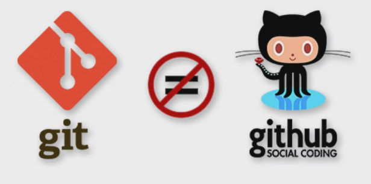
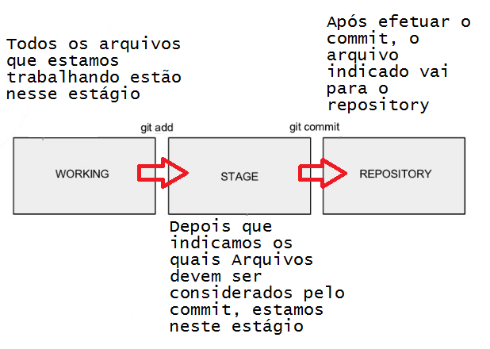
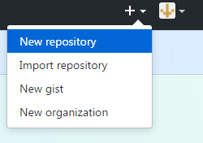
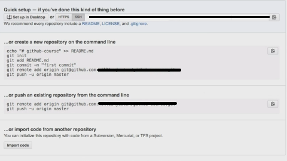
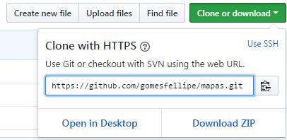

```{r setup, include=FALSE}
knitr::opts_chunk$set(echo = TRUE)
```


# Controle de versão, Git e Github

Controle de Versão permite que você registre as mudanças feitas em um arquivo ou um conjunto de arquivos ao longo do tempo de forma que se possa recuperar versões específicas. 

O Git é um dos vários Sistemas de Controle de Versão de arquivos. É um programa, uma ferramenta para versionamento de arquivos e serve para que se tenha uma linha do tempo de alterações de uma pasta, de um projeto. 

Util para não precisar fazer copias e mais copias do mesmo projeto

Para isso nasceu a ideia do controle de versão

O sistema de controle de versão tem a finalidade de gerenciar diferentes versões d eum mesmo documento

Serviço de Web compartilhado para projetos que utilizam o Git para versionamento



É um local aonde podemos depositar nossos projetos

Quase como uma rede social para desenvolvedores, seus arquivos estão na web em uma repositório remoto

O que é controle de versão?
Um sistema de controle de versão é uma ferramenta que gerencia as alterações feitas nos arquivos e diretórios de um projeto. Existem muitos sistemas de controle de versão; Esta lição se concentra em um chamado Git, que é usado por muitas das ferramentas de ciência de dados abordadas em nossas outras lições. Seus pontos fortes são:

Nada que é salvo no Git é perdido, então você sempre pode voltar para ver quais resultados foram gerados por quais versões de seus programas.

O Git avisa automaticamente quando o seu trabalho entra em conflito com o de outra pessoa, por isso é mais difícil (mas não impossível) substituir acidentalmente o trabalho.

O Git pode sincronizar o trabalho feito por pessoas diferentes em máquinas diferentes, por isso, ele é dimensionado da mesma forma que sua equipe.

O controle de versão não é apenas para software: livros, papéis, conjuntos de parâmetros e tudo o que muda com o tempo ou precisa ser compartilhado pode e deve ser armazenado e compartilhado usando algo como o Git.

# Git


"Git é um sistema de controle de versão distribuida, rápido e escalável" - tradução do manual

Basicamente é um versionador de arquivos, é utilizado principalmente para gerenciar versões de softwares desenvolvidos por um ou mais desenvolvedores e tudo é registrado em um histórico, o qual podemos retroceder sempre que necessário, os integrantes de um projeto podem enviar correções atualizações etc. As alterações enviadas para o projeto principal não comprometem o mesmo pois cabe ao dono do projeto a inclusão ou não das alterações realizadas.

## Para instalar o Git

Basta entrar no [site oficial](https://git-scm.com/downloads) e baixar os arquivos segundo seu sistema operacional e configurações

## Essenciais do Git

A seguir será apresentado alguns comandos essenciais para o uso do Git

### Como configurar o Git

Para configurar o Git precisamos indicar as informações do desenvolvedor, fazemos isto para identificar os desenvolvedores em cada commit específico:

```
#Para configurar o usuário:
git config --global user.name "gomesfellipe"

#Para configurar o email:
git config --global user.email "gomes.fellipe@hotmail.com"

```

### Iniciando um repositório

Primeiramente, vamos criar um novo diretório e em seguida iniciar nosso repository git.

O repositório é a pasta do projeto. Todo repositório tem uma pasta oculta .git. Isso é o que mostra para o git e para você que existe um repositório naquela pasta.

Abra um terminal do windowns e escreva:

```
mkdir git-course  #Criar a pasta que armazena os arquivos
cd git-course/    #Seleciona a pasta criada
git init          #Para iniciar um repositóri
```

Neste ponto já podemos ver que uma pasta "*.git*" foi criada, lá ficam os registros de todo o projeto.

Caso deseje ver quais arquivos existem no repositório, pode seguir com:

```
ls -la    
cd .git/  #Para acessar o repositório .git
ls        #Os arquivos que existem la dentro
cd ..     #Para voltar um diretório
```

Neste momento nosso repositório já foi inicializado e ja podemos mover os arquivos


### Movendo arquivos no repositório



Primeiramente, veja conceitos que precisam ser sempre lembrados:

  * **untracked**: ainda não foi visto pelo Git
  * **unmodified**: não teve nenhuma modificação
  * **modified**: o arquivo foi editado mas ainda não foi levado para ser salvo 
  * **staged**: "estou pronto para ser commitado (ou pronto para ser salvo"

Para reportar como esta o repositório neste momento:

```
git status
```

Faça uma experiencia, crie um arquivo Readme.md nesta página e rode novamente o comando `git status` . 

Provavelmente ele vai entender que tem um arquivo, porém ele ainda nao foi "empurrado". 

Agora informamos ao git que vamos adicionar o arquivo que acabamos de criar ao proximo commit (que nada mais é do que um grupo de alterações no código) :

```
git add Readme.md
```

Caso quisessemos que todos os arquivos fossem adicionados podiamos ter usado o seguinte comando:

```
git add .
```

Se digitar `git status`  agora, ele vai mostrar que existe um novo arquivo que já pode ser commitado, já podemos criar uma versão dele.

Porém, se **editar** este arquivo Readme.md ele será modificado, então, ao digitar `git status` veremos que essas modificações precisam ser novamente passadas.

Para levar as modificações, novamente digite:

```
git add Readme.md
```

E está pronto para ser commitado, faremos um commit:

```
git commit -m "Add Readme.md" #-m para adicionar uma mensagem explicativa para o commit
```

Dica: é boa pratica colocar exatamente o que estamos fazendo.

### Visualizando logs

Após fazer diversos commits é interessante vermos qual está sendo o andamento dos nosso arquivos, para isto existe o comando:

```
git log                               #Lista todos os commits já realizados
git log --decorate                    #Para ver mais informações com 
git log --autor="Fellipe"             #Filtrar por autor
git shotlog                           #Quais autores e quantidade de commits
git log -- graph                      #Forma gráfica do que está acontecendo com os branches das versões
git show                              #Quem comitou, o que comitou, quando etc
git show (copiar hash do commit aqui) #Quem comitou, o que comitou, quando etc
```

### Visualizando diff

Veremos aqui os comandos que permitem ver as diferenças dos arquivos antes mesmo de envia-los

Por exemplo, ao digitar `git status` na pasta exemplo, podemos notar que nada foi criado e não existe nenhuma ação a ser tomada. 

Então, vamos fazer uma pequena edição no arquivo .md que havia sido criado para entender a funcionalidade.

Agora, ao digitar

```
git diff
```

será mostrada a modificação feita antes de commitar (Isso é muito, muito importante)

Ao digitar `git diff --name-only` podemos ver apenas o nome do arquivo que foi modificado, caso tenha uma lista grande de arquivos modificados, pode ser uma boa opção.

Agora posso comitar, como foi um arquivo que já existiu, podemos seguir com:

```
git commit -am "Edit Readme.md"
```

**Obs**: -am vai adicionar todos os arquivos e incluir a mensagem

### Desfazendo

Uma opção legal é que o Git permite que algumas modificaçõe sejam desfeitas

#### Desfazendo uma modificação

Se digitarmos `git status` podemos ver que o arquivo nao sofreu ainda nenhuma modificação, vá no arquivo que deseje editar e após isso digite `git status`  e confira a modificação.

Mas neste caso, não desejamos continuar com esta modificação, desejamos desfaze-la, para resetar:

```
git checkout Read.md
```

Ele irá restaurar a modificação, portanto ao abrir o `git diff` já não será visto nenhuma alteração.

#### Desfazendo uma modificação antes do commit

Novamente edite o arquivo, porém, desta vez adicione o arquivo com `git add Readme.add` no repositório. Se digitar `git status` podemos notar que existe uma modificação pronta para ir, basta comitar.

Porém, não desejamos isso, queremos volta, então:

```
git reset HEAD
```
Diz que não desejamos fazer mais nada, apenas retirar o arquivo da fila do **staged**. Ao digitar `git diff` podemos ver que as diferenças já podem ser detectadas e para desfazer, basta utilizar o mesmo passo anterior com o comando `git checkout Read.md`

#### Desfazendo uma modificação depois do commit

Desta vez, edite o arquivo Readme.md novamente (modificação pode ser conferida com o comando `git status`) e vamos commitar direto, com os comandos `git commit -am "comentario"`

Para desfazer o commit, existem tres opções:

  * `--softy`: desfaz as modificações e retorna o arquivo para o staged
  * `--mixed`: mata o commit e volta os arquivos para antes do staged
  * `--hard`: ignora tudo que foi feito no commit

Portanto, esses comandos podem ser utilizados da seguinte maneira:

```
git reset --softy
git reset --mixed
git reset --hard
```

# Github 


O Github é um repositório remoto (repositório em outro servidor ou na nuvem). A idéia é a mesma de um repositório local, mas os remotos como o proprio nome diz, não estão na sua máquina, estão hospedados em servidores na internet ou outra máquina qualquer

É a maior rede social para desenvolvedores


## Criando uma conta

Para criar uma conta basta acessar o [site oficial](https://github.com/) e criar um novo usuário e em seguida configurar a chave ssh para que consigamos nos comunicar com o github.

Após criar uma nova conta, podemos criar um novo repositório a partir do botão:



A partir dai basta colocar as informações do seu repositório.

Outra questão de boas práticas é elaborar um Readme.md que informe de maneira geral de que se trata aquele repositório, para manter tudo organizado

## Ligando Github ao Git

Após criar o repositório no Github, ele próprio já fornece algumas instruções de como fazer essa ligação



Agora que possuimos uma conta, desejamos ligar o repositório do github com o git, para isso basta seguir as linhas de comando:

```
git remote add origin git@github.com:gomesfellipe/github-course.git
```
Depois disso, para enviar os arquivos que temos para o repositorio especificado:

```
git push -u origin master
```
 Feito isso, ao apertar `Enter` ele irá enviar seus arquivos para o repositório do Github
 
## Enviando mudanças para o repositório remoto

Após modificar o arquivo, comitamos com as linhas (-a para adicionar direto):

```
git commit -am "Add algo"
```

Porém, esta informação ainda não esta no github pois ainda não fizemos o push, portanto:

```
git push origin master
```

Feito isso , será enviado as modificações para o github

## Clonando um repositório

É muito comum querermos clonas algum repositório já existente para nossa máquina. Para isso podemos acessar o link através do botão : 

 

Na página do diretório de interesse, portanto copiamos o link e voltamos para o terminal, selecionamos a pasta que desejamos clonar os arquivos e digite:

```
git clone https://github.com/gomesfellipe/mapas.git github-course-clone
```

## Fork

É uma maneira de enviar mudanças, correções ou adaptações em códigos que não são nossos

Ao fazer o fork, copiamos todo o repositório para dentro do nosso repositório e podemos trabalhar em cima e fazer nossas modificação e por fim submeter ao dono dos arquivos que foram "forkados"

## Branch (Ramificação)

(continua...)

